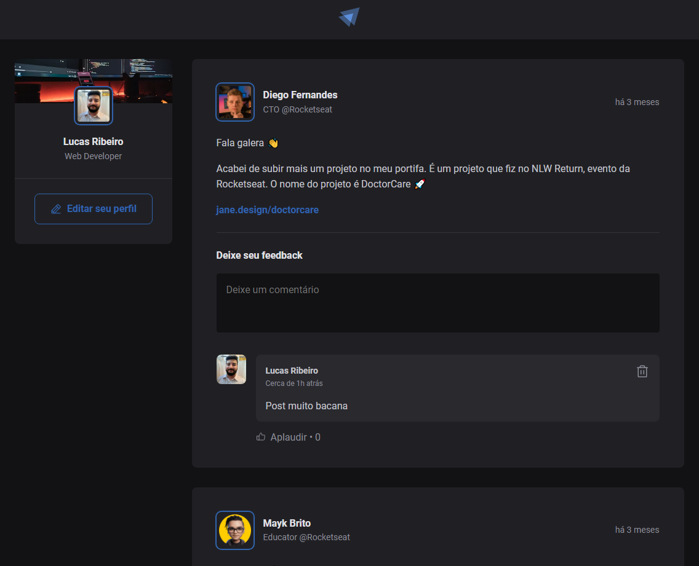

<div align="center">
  
</div>

<h1 align="center">
Ignite Feed 
</h1>

<h2 align="center">Preview: <a href="https://ignite-feed-react-chi.vercel.app" target="_blank">Ignite Feed</a> </h2>

---

<div align="center">
  
</div>

## 📄 Projeto
Aplicação React utilizando o Vite para aplicar os conceitos mais importantes do React: Componentização, Propriedades, Estados, Imutabilidade e Hooks.

## 💻 Tecnologias

- **ReactJS**
- **TypeScript**
- **CSS**

## 🔖 Layout
- [Ignite Feed - Figma](https://www.figma.com/file/OhrrVFoJL0jLISUPnw5W34/Ignite-Feed?type=design&node-id=26%3A12&mode=design&t=363FAWM22UlJnwSA-1)

## 🚀 Executando o projeto

- Clone o projeto e acesse o diretório

```bash
$ git clone https://github.com/luc-ribeiro/ignite-feed-react.git
$ cd 
```

- Siga os passos abaixo:
```bash
# Instale as dependências
$ npm i

# Inicie o projeto
$ npm run dev
```

- A aplicação estará disponível no endereço `http://localhost:5174`
